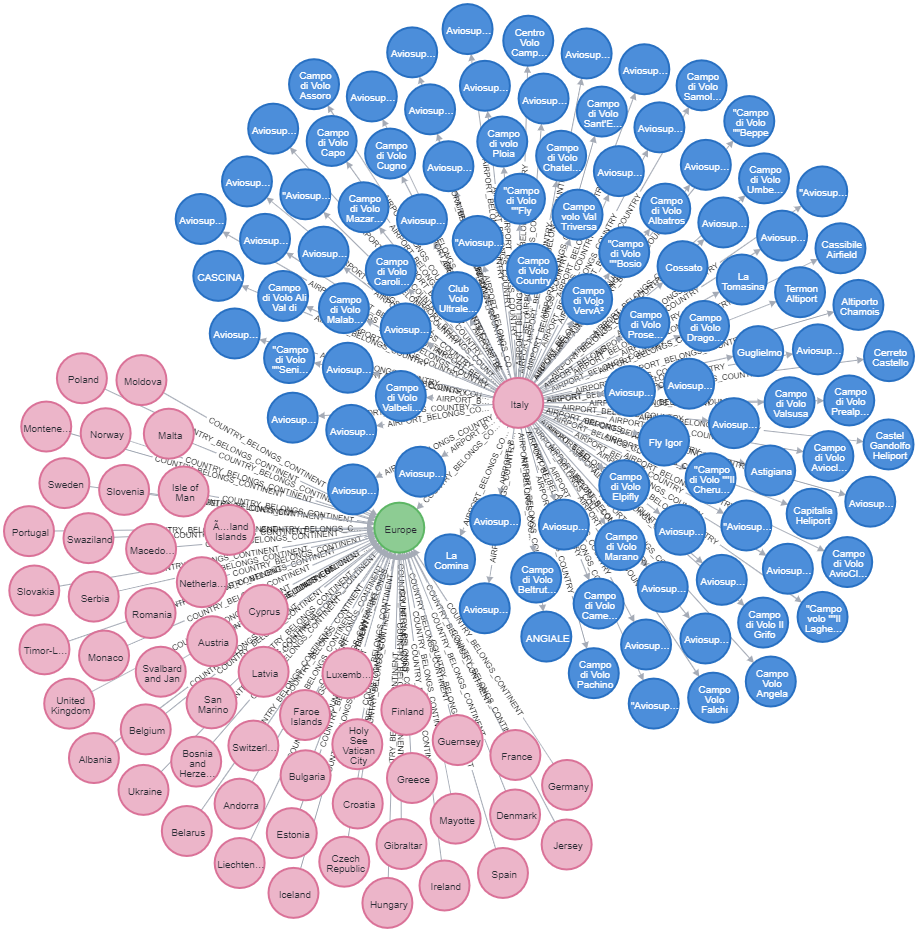

#Neo4 on Spark on Scala

### Run the environment
- run spark inside the `docker/spark` folder with the following command: `docker-compose up`
- run neo4j inside the `docker/neo4j` folder with the following command: `docker run -d --publish=7474:7474 --publish=7687:7687 --env=NEO4J_AUTH=none --name neo4j neo4j`

### Feed the db
- run `src/main/scala/com/academy/ProduceData.scala`
- run `src/main/scala/com/academy/ProduceMatch.scala`

### Open the neo4j terminal
- go to `http://localhost:7474/browser/` and just hit the `connect` button (this docker is running with `--env=NEO4J_AUTH=none`)
- click on any node-label (if your already fed the db) just to gain confidence

### TroubleShooting on relationships-creation
If relationships have not been created is because you haven't enough permissions (you are probably working in `FULL_RESTRICTED_READ` mode).

Fix your privileges or just run the following queries from your neo4j terminal (inside the docker or at your localhost:7687):
- `MATCH (c1:Country), (c2:Continent) WHERE c1.continent=c2.code CREATE (c1)-[:COUNTRY_BELONGS_CONTINENT]->(c2)`
- `MATCH (c1:Country), (a:Airport) WHERE c1.code=a.iso_country CREATE (c1)-[:AIRPORT_BELONGS_COUNTRY]->(a)`

### Take a look at the result
If you completed properly the previous steps, run from your neo4j terminal (at your localhost:7687 or from the Neo4jDesktopApp) the following query:

`MATCH (n:Continent) WHERE n.code="EU" RETURN n`

Playing with the nodes you should now obtain something like this
  
  
#### Author
ciccottandrea@gmail.com